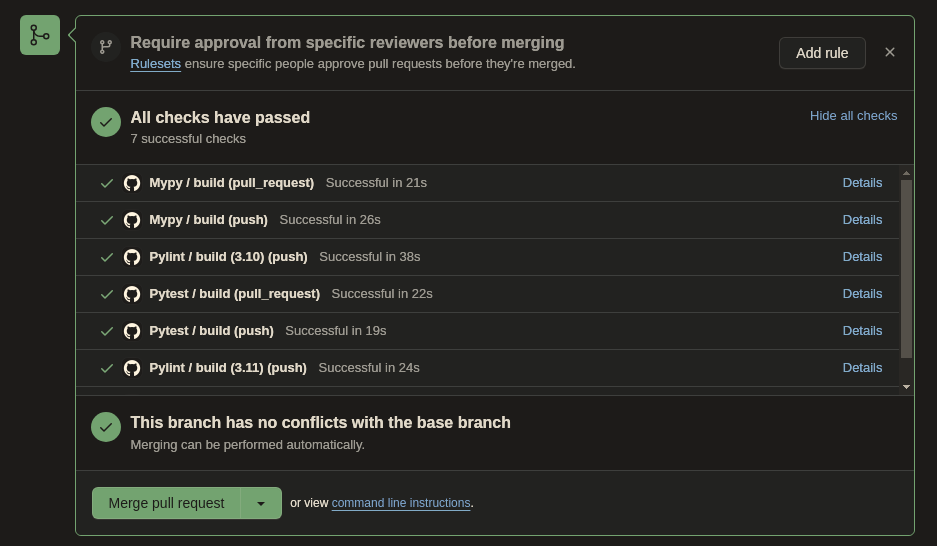
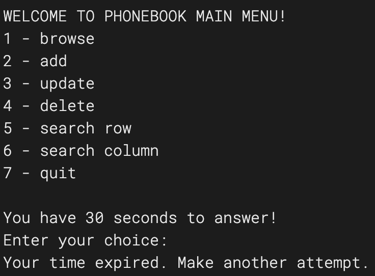
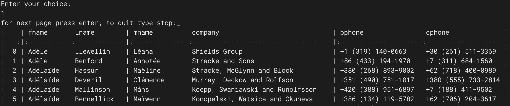
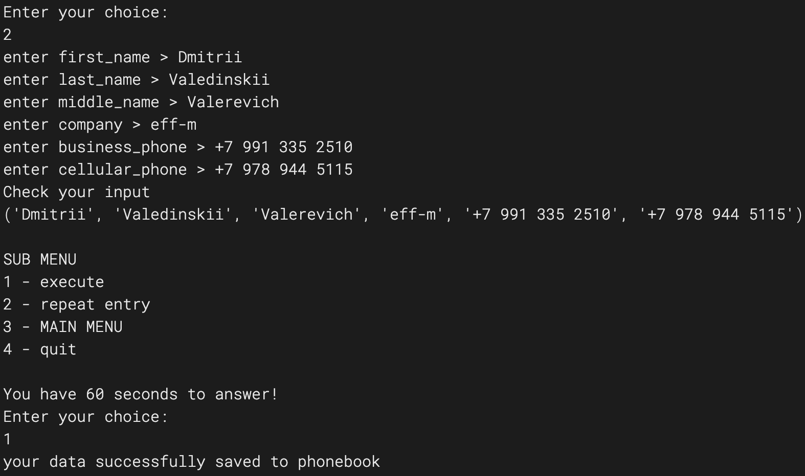
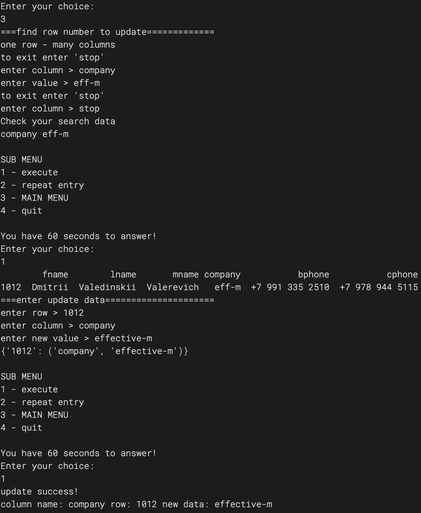
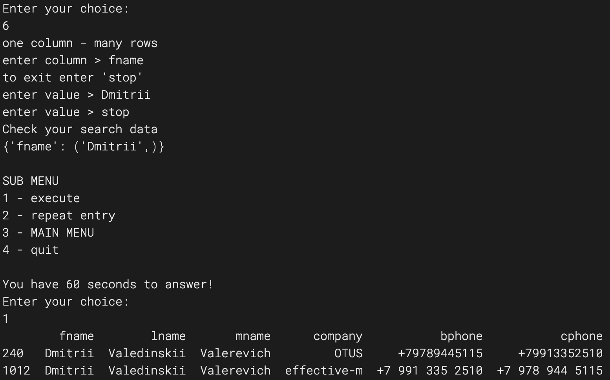
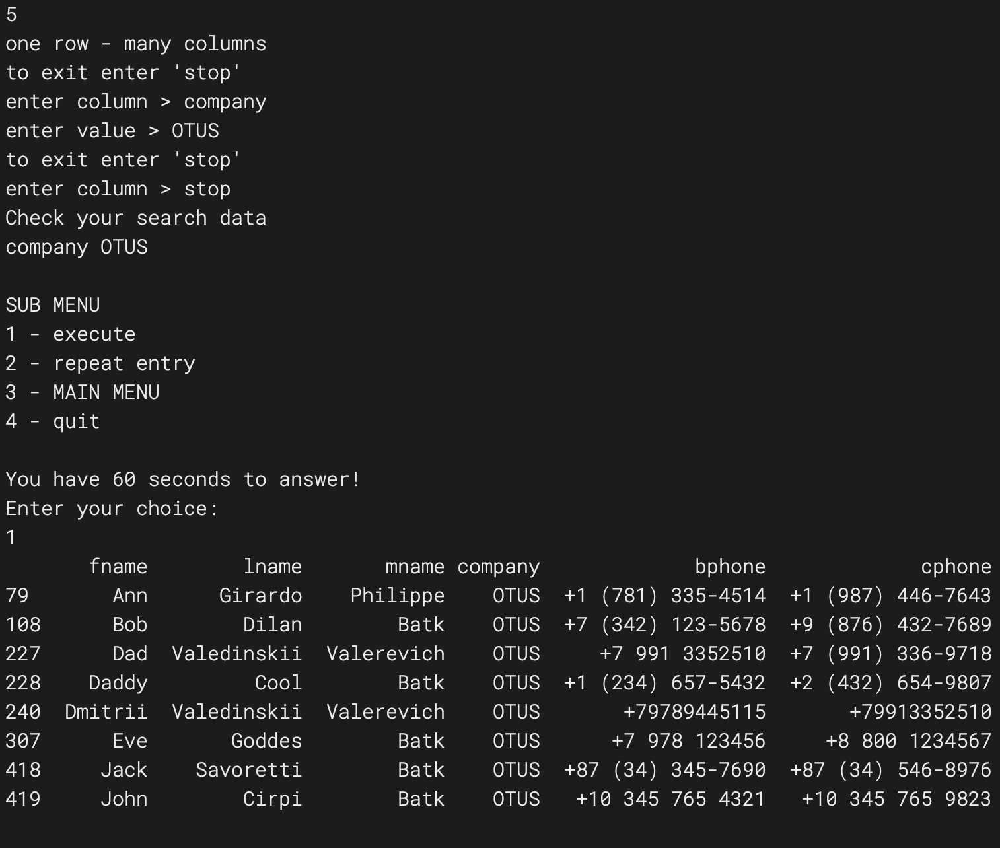
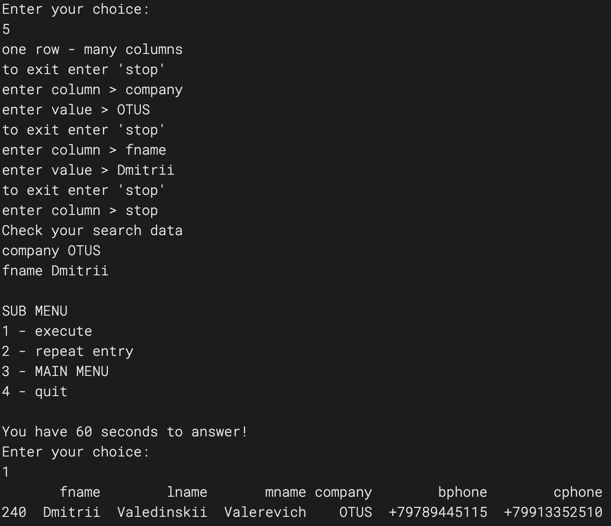
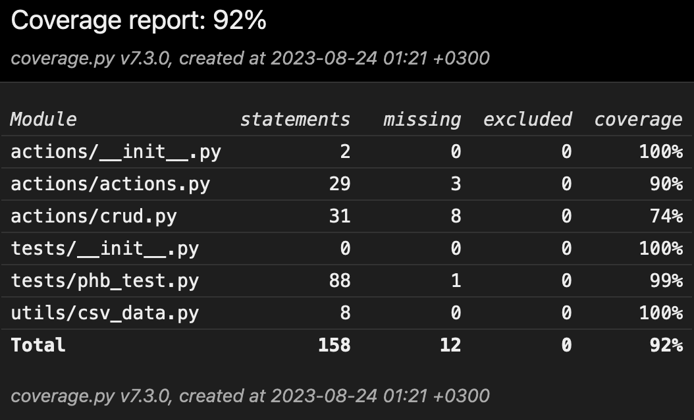

### ТЗ:

Реализовать телефонный справочник со следующими возможностям:

- Вывод постранично записей из справочника на экран
- Добавление новой записи в справочник
- Возможность редактирования записей в справочнике
- Поиск записей по одной или нескольким характеристикам

Требования к программе:

- Реализация интерфейса через консоль (без веб- или графического интерфейса)
- Хранение данных должно быть организовано в виде текстового файла, формат которого придумывает сам программист 
- В справочнике хранится следующая информация: фамилия, имя, отчество, название организации, телефон рабочий, телефон личный (сотовый)

Плюсом будет:

- аннотирование функций и переменных 
- документирование функций 
- подробно описанный функционал программы 
- размещение готовой программы и примера файла с данными на github

Телефонный справочник реализован с использованием .csv файла в качестве БД.
Для работы с БД используем pandas.

### Выполненный рефакторинг

16.02.2024

Выполнена декомпозиция кода на отдельные действия, пользовательские интерфейсы, меню. 
Для устранения избыточности кода применен декоратор sub_menu_decorator.py.
Интересно выглядит построение матрицы поиска для нескольких условий:
```code
 aggregate_mask = masks[0]
    for mask in masks[1:]:
        # aggregate_mask contains any given columns data to be contained in a single row
        aggregate_mask = aggregate_mask & mask
    res = df[aggregate_mask]
```

Добавлены аннотации типов и документирование функций. Добавлен GitHub Mypy workflow 
для проверки статической типизации. Тесты пройдены. Есть возможности для дальнейшей оптимизации.

[]()

### Запуск приложения:

```code
 python main.py
```
[]()

1 - последовательное чтение справочника по 50 записей на страницу\
2 - добавление новой записи\
3 - редактирование записи\
4 - удаление записи\
5 - поиск записи по одному или нескольким значениям полей для уточнения результата\
6 - поиск записей по одному или нескольким значениям одного поля\
7 - завершение работы

Если .csv файл на пути, указанном в csv_dir/csv_data.py:
```code
path = "csv_dir/phone_book.csv"
```
не существует, то функция create from actions/crud.py создает новый пустой файл phone_book.csv.

##### Постраничное чтение

[]()

##### Добавление записи

[]()

##### Редактирование записи

[]()

##### Поиск записей по одному или нескольким значениям одного поля (6)

[]()

##### Поиск записи по одному или нескольким значениям полей для уточнения результата (5)

[]()

##### Теперь уточним параметр поиска:

[]()

Функционал соответствует ТЗ.
Задание выполнено.

Написаны модульные тесты для проверки операций CRUD, SEARCH.

[]()
